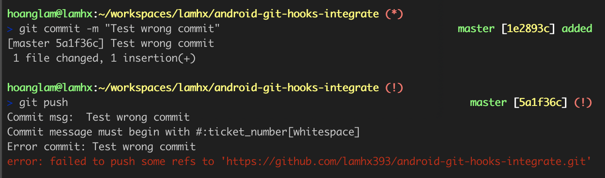

# Tổng quan
Git hooks là các tập lệnh theo kịch bản được chạy tự động mỗi lần có phát sinh sự kiện từ Git Repo.<br>
Các Hooks được lưu giữ tại `.git/hooks` chung cấp với thư mục gốc của Repo (`{name_hook_script}.sample`).<br>
Có nhiều loại `hooks` tùy vào mục đích sử dụng với nhằm chuẩn hóa project theo các yêu cầu.<br>

### Một số loại git hooks thường dùng
* `pre-commit` : Script trong này sẽ được thực thi trước khi nhập nội dung của message của một commit.
* `commit-msg` : Thực thi lúc xác nhận msg của commit, thích hợp dùng để chuẩn hóa msg của một commit.
* `pre-push`   : Thực thi trước khi một commit được đẩy lên Git Repo. 

## Cài đặt
Để mỗi hook script được thực thi, chỉ cần đổi tên `{name_hook_script}.sample` thành `{name_hook_script}`. Mỗi lần có sự kiện từ Git Repo, Git sẽ tự kiểm tra và thực thi kịch bản được định nghĩa trong `{name_hook_script}` tương ứng.

## Vấn đề
`.git/hooks` sẽ không được đồng bộ lên repo, nên việc cài đặt này phải tự làm bằng tay ở client. Nếu làm việc theo team, project cùng làm trên nhiều máy client khác nhau thì việc có script để tự động hóa quá trình cài đặt GitHooks này là điều cần thiết (những việc lặp đi lặp lại cùng 1 quá trình và cùng 1 kết quả thì nên tự động hóa thay vì thực hiện tay hết lần này tới lần khác).

Để đồng nhất tự động hóa được quá trình, cách tốt nhất là cho nó chạy chung với project.

## Cách tiếp cận
Script cài đặt GitHook sẽ được chạy chung với `gradle` của project.<br>
Để tránh quá trình cài đặt này bị lặp lại với mỗi lần `gradle` được chạy, sẽ dùng một biến nội bộ được lưu giữ trong `local.properties`. Nếu cờ cài đặt không tồn tại (hoặc chưa mang giá trị thông báo quá trình cài đặt thành công), sẽ thực hiện các quá trình cài đặt Githook.

#### app/gradle.build
```gradle
    // Setup GitHooks task
    task setupGitHooksTask(type: Exec) {
        commandLine 'bash', './setupGitHooks.sh' //Quá trình cài đặt sẽ được định nghĩa trong setupGitHooks.sh
    }

    // Check condition to execute setup's script
    def props = new Properties()
    def localPropertiesFile = rootProject.file("local.properties")
    def setupGitHooks = false
    if (localPropertiesFile.exists()) {
        localPropertiesFile.withInputStream { props.load(it) }
        setupGitHooks = props.getProperty("setup.githooks") == "true" //Kiểm tra cờ cài đặt githook
    }

    if(!setupGitHooks) { //Cài đặt GitHooks nếu chưa nhận được cờ cài đặt thành công
        preBuild.dependsOn setupGitHooksTask
        println "Setup GitHooks success"
    }
```

#### setupGitHooks.sh
##### Trong ví dụ, chỉ thay đổi hook `pre-push` để demo.<br> 
Thay vì chỉnh sửa kịch bản trong `.git/hooks` thì sẽ tham chiếu nó tới 1 file thực thi bên ngoài để tiện cập nhật và theo dõi.<br>
Tham chiếu các kịch bản của hook `pre-push` bằng file script `pre_push.sh` nằm ngoài thư mục gốc. <br>
```shell
    # Linking pre-push's script to `pre-push.sh` shell
    mkdir -p ../.git/hooks; echo './pre_push.sh' > ../.git/hooks/pre-push; chmod +x ../.git/hooks/pre-push;

    # Sign the flag to done status
    echo "setup.githooks = true" >> ../local.properties

```

#### pre_push.sh
Script `pre_push.sh` sẽ kiểm tra message commit phải đúng quy định.<br>
Yêu cầu message commit phải bắt đầu bằng `#:ticket_number[whitespace]`, nếu không thỏa mãn thì thông báo lỗi và dừng quá trình đẩy commit lên repo.<br>

```shell
    regex='^#[[:digit:]]* '
```



## Tham khảo
https://git-scm.com/docs/githooks<br>
https://www.atlassian.com/git/tutorials/git-hooks<br>

##
Hope well done!


